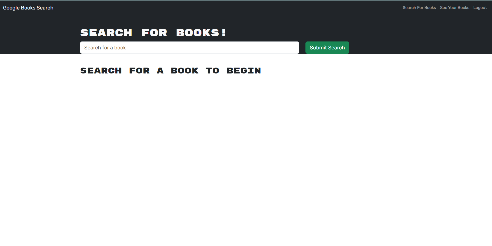
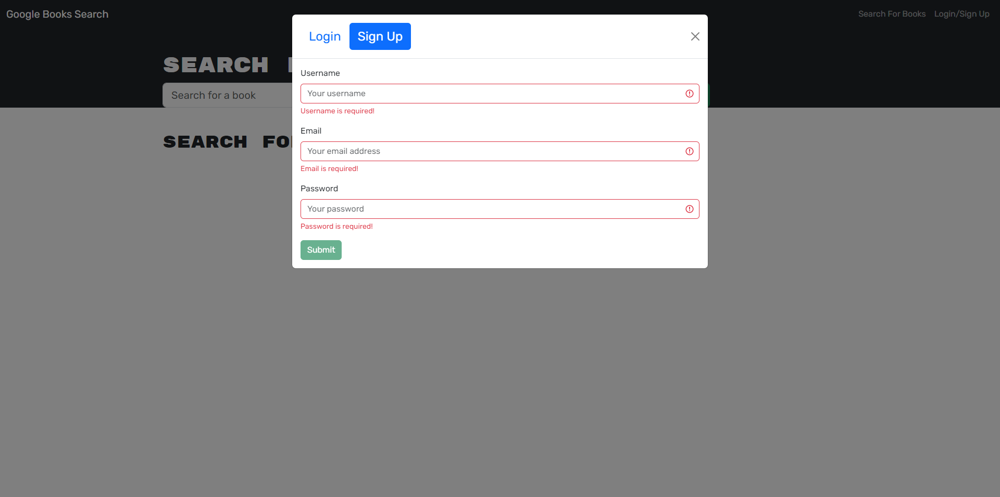
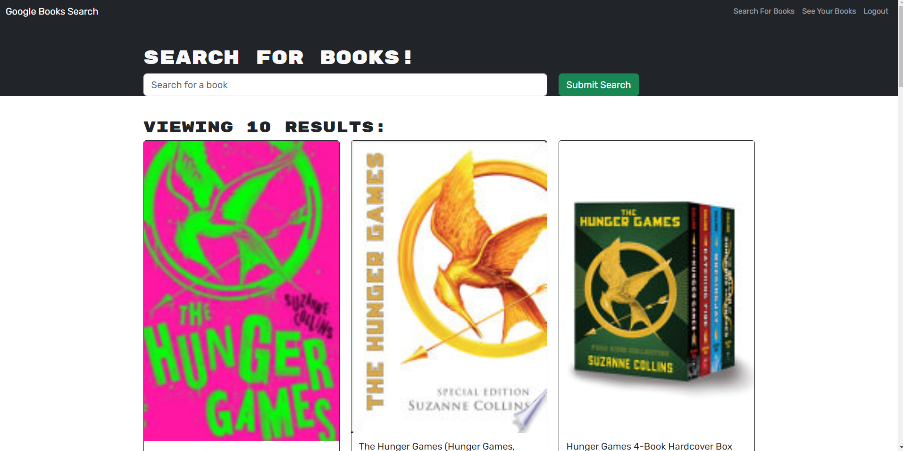
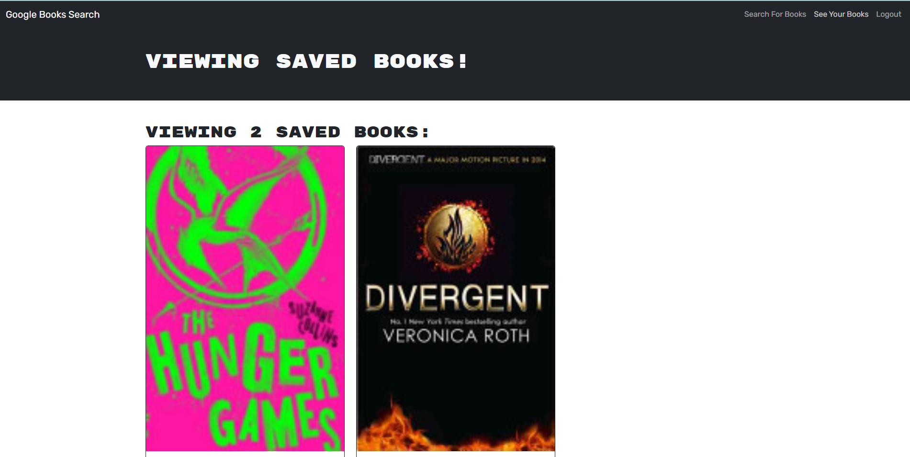

# book-search-engine

## Description

This project was built so that users can search for books and save their favorites with an account. It was created using the MERN stack, MongoDB, Express.js, React.js, and Node.js. It offers users simplicity in being able to save and delete books from their list.

## Table of Contents

- [Usage](#usage)
- [Credits](#credits)

## Usage

This is the home page users are brought to when visiting the website.

After signing up, the users are able to unlock the functionality to save books and view all their saved books. Without authorization, users can just search books.

This is the search results displayed after searching "The Hunger Games", which is fetched from the Google Books API.

Clicking the "See Your Books" tab while logged in allows users to see the books that they have saved and the option to delete the book from the list.

## Credits

* Tutor Joem Casusi
* Classmate Justin Choi for letting me borrow his Google Books API key